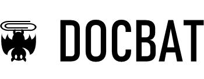

[](https://opensource.org/licenses/BSD-2-Clause)

[](https://www.npmjs.com/package/docbat)

[](http://www.deftio.com/docbat)

Docbat is a simple javascript utility which takes coverts several file types to html pages.  This is useful for build scripts where you want to able to just browse a directory and have see the same content as a README.md but don't have a markdown viewer installed (say as a browser extension).

Docbat provides methods to add formatting to the HTML page such as custom CSS or other constructs after the markdown conversion so that the HTML isn't just raw.  Docbat's default options provide simple margins and padding for reasonable view across desktop and mobile device contexts.

## Simple Usage:
```bash
npx docbat -i inputfile.md -o outputfile.html 
```
if the -l parameter is included all libraries will be embedded in the page as a single stand alone file with support for code syntax higlighting.

```bash
npx docbat -i inputfile.md -o outputfile.html -l
```

Supported input file types:
* Markdown
* raw text
* tab delimited text (also see examples for adding titles)
* images (no processing is performed on the images)

Supported output:
* HTML page (with default headers / titles which are overridable)
* HTML raw (just HTML which can then be chained / piped together)
* HTML-JSON - as a JSON construct (this leverages the bitwrench.js library, see that library for more details on npm or github)
* proper formatting, including syntax highlighting for code blocks (via higlight.js)

Future: 
Docbat exposes the following file distribution libraries:
* docbat.js     - ES5 / browser library for doing all operations.  
* docbat.mjs    - ES6 module (uses export/import otherwise same as docbat.js)
* docbat-cli.js - commandline program for scriptting operations


## Usage at Commandline

simple usage to convert markdown to html

```bash 
./docbat-cli.js -i myfile.md -o myoutput.html

type docbat --help for more commandline options
```


simple usage to convert markdown to pdf

```bash 
./docbat-cli.js -i myfile.md -o myoutput.pdf -p true

```

### Code Syntax Support

Code syntax highlighting is supported.  Here is a Javascript example:

```javascript
let addTwoNumbers = function(a,b) { return a+ b}

const myObject = {
   "one": "this is it,
   2: [1,2,3,4,5],
   3: { "an embedded object": "I am a js object!", 8 : "eight"}
}

```

and here is python

```python
"""
Simple python code example
"""
#import myLibrary
def addTwoNumbers(a,b)
  return a+b

```


## Usage as a library


## Dependencies (only important if building from source)
docbat uses the nodejs javscript runtime along with some packages which are available via the npmjs javascript packaging service.

Technologies:
* nodejs javascript runtime -  [nodejs](https://nodejs.org/en/)  
* npm - package manager javascript packages - [npm](https://docs.npmjs.com/cli/install)

Key Packages:
* showdown.js for markdown parsing - [showdown.js](https://www.npmjs.com/package/showdown)
* bitwrench.js for page formatting duties - [bitwrench](https://www.npmjs.com/package/bitwrench)
* command-line-args for argument processing - [command-line-args.js](https://www.npmjs.com/package/command-line-args)
  
For buildings from Source:
* webpack and webpackcli
* del-cli

For Testing:
* 

   

## Source code home  
all source is at github:  
[docbat  on github](http://github.com/deftio/docbat )  


## Linting 
docbat  uses eslint for static code checking and analysis.

```bash
npm install eslint --save-dev

./node_modules/.bin/eslint --init

```
Now run the lint test like this:
```bash
./node_modules/.bin/eslint docbat.js   
```

## Release History  
* 0.91 Initial release  
* 0.94 added pdf output support
  
## License  
docbat  is released under the OSI Approved FreeBSD 2-clause license  


